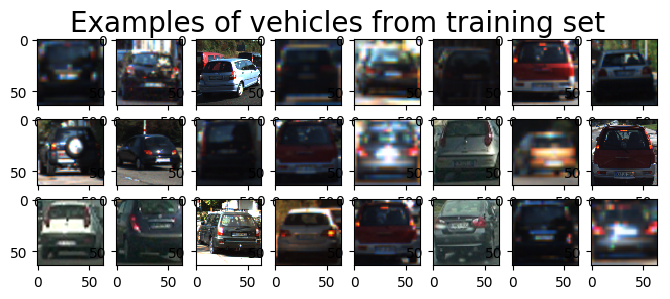
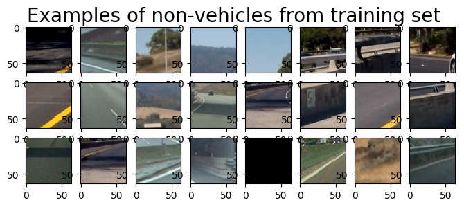
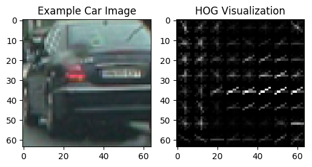
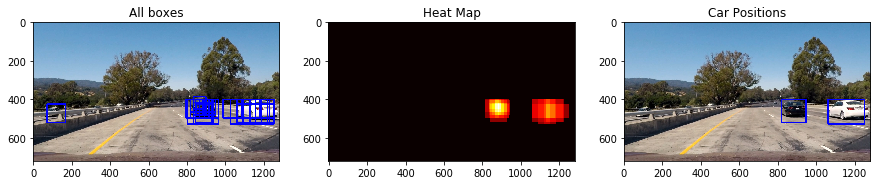
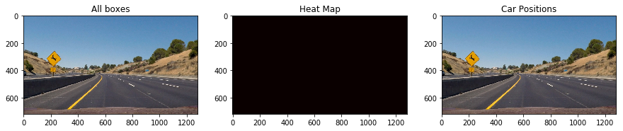
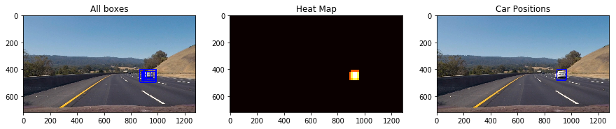
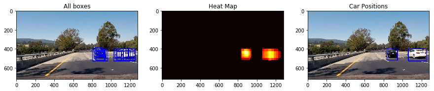
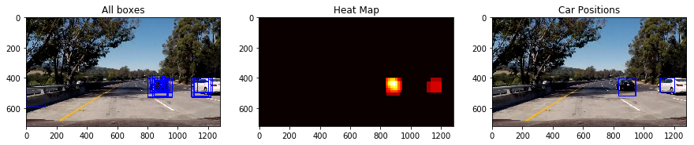
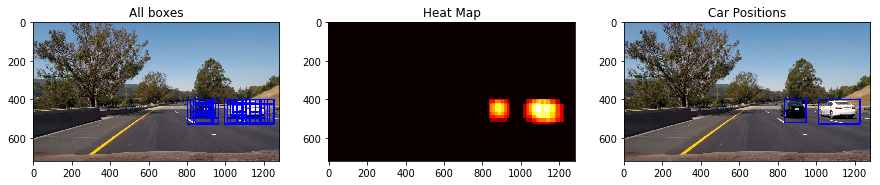

# Vehicle Detection

The goals / steps of this project are the following:

* Perform a Histogram of Oriented Gradients (HOG) feature extraction on a labeled training set of images and train a classifier Linear SVM classifier
* Optionally, you can also apply a color transform and append binned color features, as well as histograms of color, to your HOG feature vector. 
* Note: for those first two steps don't forget to normalize your features and randomize a selection for training and testing.
* Implement a sliding-window technique and use your trained classifier to search for vehicles in images.
* Run your pipeline on a video stream (start with the test_video.mp4 and later implement on full project_video.mp4) and create a heat map of recurring detections frame by frame to reject outliers and follow detected vehicles.
* Estimate a bounding box for vehicles detected.

### Dataset

In this project I use two datasets. Here are links to the labeled data for [vehicle](https://s3.amazonaws.com/udacity-sdc/Vehicle_Tracking/vehicles.zip) and [non-vehicle](https://s3.amazonaws.com/udacity-sdc/Vehicle_Tracking/non-vehicles.zip) examples to train your classifier. These example images come from a combination of the [GTI vehicle image database](http://www.gti.ssr.upm.es/data/Vehicle_database.html), the [KITTI vision benchmark suite](http://www.cvlibs.net/datasets/kitti/), and examples extracted from the project video itself.

Number of vehicle images: 8792
Number of non-vehicle images: 8968

Below, there are a few examples from these datasets. 

  
  

### Histogram of Oriented Gradients (HOG)

The code for this step is contained in lines 108 through 215 of the file called `VehicleDetection.py`.   

I then explored different color spaces and different `skimage.hog()` parameters (`orientations`, `pixels_per_cell`, and `cells_per_block`).  I grabbed random images from each of the two classes and displayed them to get a feel for what the `skimage.hog()` output looks like.

Here is an example using the `RGB` color space and HOG parameters of `orientations=8`, `pixels_per_cell=(8, 8)` and `cells_per_block=(2, 2)`:

  

#### HOG parameters.

I tried various combinations of parameters. After a few iterations of training SVM classifier I decided to set the following HOG parameters.

color_space = 'YCrCb' # Can be RGB, HSV, LUV, HLS, YUV, YCrCb 
orient = 8  # HOG orientations 
pix_per_cell = 8 # HOG pixels per cell 
cell_per_block = 1 # HOG cells per block 
hog_channel = 'ALL' # Can be 0, 1, 2, or "ALL" 
spatial_size = (16, 16) # Spatial binning dimensions 
hist_bins = 64    # Number of histogram bins 
spatial_feat = True # Spatial features on or off 
hist_feat = True # Histogram features on or off 
hog_feat = True # HOG features on or off 

#### SVM classifier

I trained a linear SVM in lines 485 through 538 of the file called `VehicleDetection.py`. As noted above (HOG parameters) except HOG features, also spatial color features and color histogram features are taken to the SVM classifier.

I used SVM classifier from sklearn library with linear kernel and default parameters. Also I used StandardScaler for feature normalization along resulting dataset. The final obtained accuracy was 0.9887. 

#### Sliding Window Search

The code for this part is located in lines 625 through 730 of the file called `VehicleDetection.py`. For different y positions I defined different windows scales as below:

ystart = 370 
ystop = 500 
scale = 1.0 
     
ystart = 400 
ystop = 600 
scale = 1.5 
 
ystart = 400 
ystop = 650 
scale = 2.0 
 
ystart = 450 
ystop = 660 
scale = 2.5 

Typically, there are a several window detections for a car. On the other hand there are only a few detections for false positives. Therefore, to differenciate between these two situations, there is a add_heat function added to a pipeline. It returns bigger intensity for these pixels, which are multiple times classified as car. After applying a threshold, we can decide if the region is a car or not.

#### Final pipeline results

Below, there is a final result presented. For an exemplary 6 images, all ddetected bounding boxes are showed. The middle image presents a heat map, while the last outputs the final result after thresholding the heatmap.

  
  
  
  
  
  

### Video Implementation

Here's a [link](./project_video_output.mp4) to the final video after processing with the developed pipeline.

### Discussion

The pipeline generally works fine. But it is possible to fail when there is a vehicle object which is not similar to any of objects present in vehicles dataset. The final result can be also worse in rainy conditions or during a night. As we can see in the output video, where vehicles occlude, the pipeline returns one big object instead 2 occluding cars.
